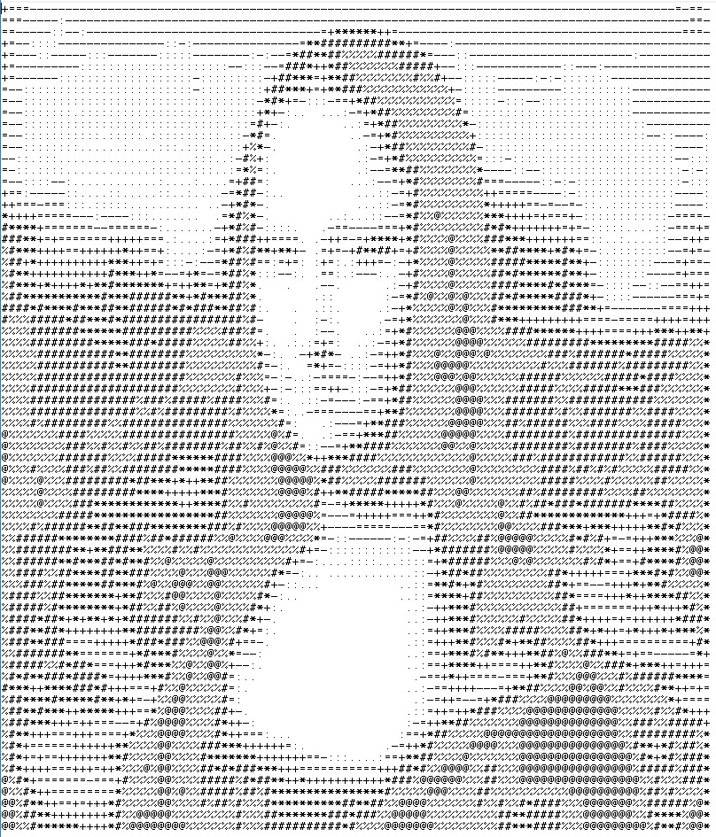

# ASCII-Generator
---

**Members**

  Moisés Uriel Torres....A01021323   
  
  Camila Rovirosa Ochoa...A01024192

**Professor:** Gilberto Echeverria Furio
**Lecture:** Programming Languages

---
## Problem description

Our project consists on a program that transforms an image into a representation of that image using ASCII code. The user will input the image they want to transform and the result will be printed into a text file. The resulting image will look as the following one:

 

## Solution

The program will be created using Racket. For the process of creating the ASCII image, first, the original image must be read and saved into the program. We will need to change and store the value of each pixel. This can be done using the “2htpd/image” module and storing the image into a bitmap. Then, the image must be scaled in order to have a standard size for all images and so the ASCII image isn’t too big or too small. Once it has the correct height and width, each pixel of the image will be turned into grayscale, so we have only the luminous intensity of each pixel instead of having the whole RGB value. After that, we will need to divide the image into a grid of small squares and for each square of the grid we will get the average luminosity value. This is because an ASCII character is much bigger than a pixel, so we need to reduce an area of pixels into one value that can be represented by a character. If we didn’t do this, the final image would look weird. Finally, we will map each average value with its corresponding ASCII character and we will print them into a text file. 

## Topics 

The topics seen in class that we will use in the program are:
- Functional programming: We will be using racket to do the program, so we will need to use functional programming.
- File input/output: We will read an image file and then output the result into a text file.
- Lists: We will use lists to store the values for the pixels and to send them to the threads so they can process them.

## How to run the program
2. First you will need to have racket intsalled in your computer : https://docs.racket-lang.org/pollen/Installation.html
3. Run **Racket** in your terminal if you have Linux or in Dr. Racket for other OS
  -> using the comand "racket" inside the location where the code is
4. Then use the following comand to start the program: 
  -> (enter! "Ascii_Generator.rkt")
5. And then create your ASCII image with an begin the program using the following comand:
  -> (main "Test_images/not_bad.jpg" "nameOfYourNewFile.txt")
  - main is the function that will start to run the program
  - Test_images is where we have saved our fine selection of images to test
  - After the  **/** the rest is the name of the image you wish to convert to ascii
  - The last part is the name of the file type.txt where you want to save the ascii image
6. And done enjoy your ASCII generator!!!

